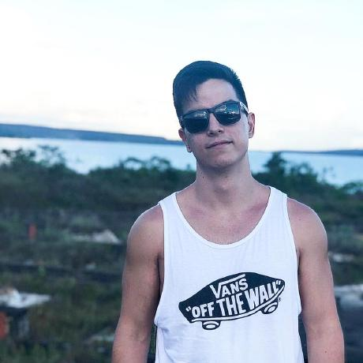

# Projeto

Esse repositório será destinado à matéria Requisitos de Software da Faculdade do Gama(FGA), Universidade de Brasília(UnB) e tem como finalidade o estudo dos requisitos da aplicação Rappi.

## A aplicação

A Rappi é um app de entregas, seguindo o Workflow estabelecido pelo iFood, você, enquanto usuário cria uma conta, escolhe um produto, cadastro um meio de pagamento e faz um pedido baseado nos produto escolhido. Entretanto, apesar de suas semelhanças com outros apps do mesmo nicho, a Rappi se tornou disruptiva, principalmente, devido a o que pode ser pedido em sua plataforma, seus concorrentes se limitam a comida vinda de restaurantes e lanchonetes, a Rappi também cobre outros tipos de comércio como mercados e farmácias.

## Equipe

  

    

        
            

              

                Wictor Girardi 17/0047326
              

            

    

    

          
          

            

              Lucas Ganda 17/0039668
            

          

    

   
  

    

        
        

          

            André Freitas 17/0056155
          

        

    

    

          
        

            

             João de Assis 17/0036634
            

        

    

     
   

    

        
        

          

            Gustavo Veloso  17/0065251
          

        

    

    

      
      

          

            Daniel Ashton 19/0127708
          

        

    

  

## Documentação feita no Drive

Para acompanhar os arquivos que foram criados, acesse o link:
https://drive.google.com/drive/folders/1HCH7R9s4bXuIPW0HDQ2EpdCnBkDU2sWT?usp=sharing
